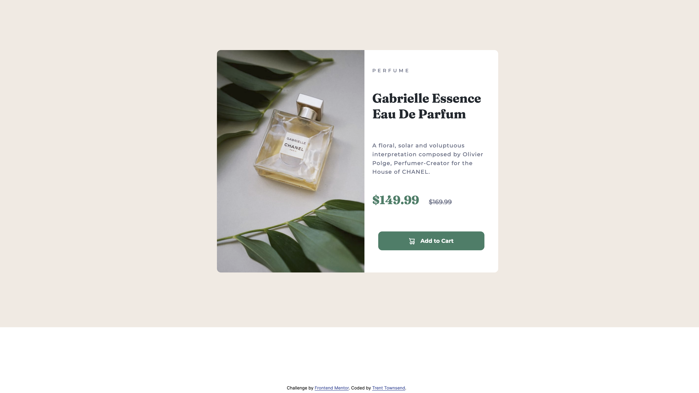

# Frontend Mentor - Product preview card component solution

This is a solution to the [Product preview card component challenge on Frontend Mentor](https://www.frontendmentor.io/challenges/product-preview-card-component-GO7UmttRfa). Frontend Mentor challenges help you improve your coding skills by building realistic projects. 

## Table of contents

- [Overview](#overview)
  - [The challenge](#the-challenge)
  - [Screenshot](#screenshot)
  - [Links](#links)
- [Built with](#built-with)
- [Author](#author)

## Overview

### The challenge
Users should be able to:
- View the optimal layout depending on their device's screen size
- See hover and focus states for interactive elements

### Screenshot

### Links

- Live Site URL: [View Project in Browser](https://trent-townsend.github.io/Product-preview-card-component-Frontend-Mentor-/)
- Solution URL: [HTML](https://github.com/trent-townsend/Product-preview-card-component-Frontend-Mentor-/blob/main/index.html), [CSS](https://github.com/trent-townsend/Product-preview-card-component-Frontend-Mentor-/blob/main/styles.css)

### Built with
- Semantic HTML5 markup
- CSS custom properties
- Flexbox
- Mobile-first workflow

## Author

- Website - [Trent Townsend](https://www.trenttownsend.com)
- Twitter - [@trent_townsend](https://www.twitter.com/trent_townsend)
